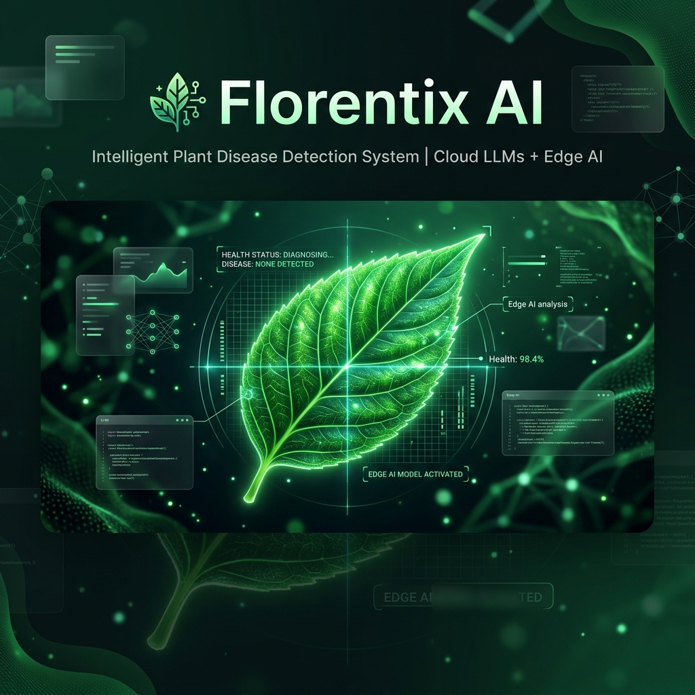

<div align="center">
  
  <br/>
  <h1>🌿 Florentix AI — Intelligent Plant Pathology</h1>
  <p><strong>A production-ready, hybrid-cloud platform for proactive plant health diagnostics.</strong></p>

  <p>
    
    
    
    <br/>
    
    
  </p>
</div>

---

## 🚀 Overview

**Florentix AI** bridges the gap between botanical expertise and deep learning. It is an enterprise-grade web application designed to automatically scan, diagnose, and curate treatment plans for diseased plant life. 

Engineered with modern web architectures in mind, Florentix utilizes a **Multi-Tiered Hybrid Inference Pipeline**, cascading between local Edge CNN models (for hyper-focused specialist domains) and advanced Cloud Vision LLMs (Gemma-3-12B/4B) to guarantee 100% response reliability regardless of external server loads or spotty networks.

---

## 🔥 Key Highlights for Technical Recruiters

- **Dynamic AI Orchestration Layer**: Designed a robust failover API in Python/FastAPI. The orchestrator intelligently prioritizes Cloud Vision LLMs, falling back to a locally packaged **TensorFlow Lite (XNNPACK)** Convolutional Neural Network if the cloud layer times out or drops to sub-standard confidence scores. It *never* hallucinates data to the user.
- **Serverless Hybrid Deployment**: Decoupled monolithic architectures to optimize for free/low-cost tiers. The static frontend is hosted on **Vercel** with client-side image compression (reducing payloads from 15MB 4K images to <500KB Canvas chunks), whilst the heavy inference environment securely resides in a **Dockerized Render** instance.
- **Asynchronous Data Streaming**: Developed a buffer-controlled Server-Sent Events (SSE) chat pipeline for the 'AI Botanist', managing concurrent HTTP abort requests, connection drops, and persisting complex chat histories natively to Firebase.
- **Micro-Interaction UI/UX**: Hand-crafted a stunning, glassmorphism-inspired Single Page Application (SPA) without relying on heavy frameworks like React. Built strictly on Vanilla JS and TailwindCSS to achieve extreme lightweight performance and robust cross-device responsiveness.

---

## 🛠 Technology Stack

### Frontend Architecture (Vercel)
* **Core:** Vanilla JavaScript (ES6+), HTML5
* **Styling:** TailwindCSS with highly custom utility plugins and CSS micro-animations
* **Authentication & DB:** Firebase v10 (Auth, Firestore)
* **Feature Integration:** Open-Meteo Integration for real-time localized environmental intelligence (Humidity, UV Index, Wind, Soil suggestions).

### Inference Backend (Render / Docker)
* **Framework:** FastAPI (Uvicorn Async ASGI)
* **Containerization:** Docker (Debian Slim, Multi-stage builds)
* **Machine Learning:** TensorFlow Lite (`tflite-runtime`) configured with XNNPACK delegates for optimized low-memory CPU prediction.
* **LLM Engine:** OpenRouter API explicitly calling Google's `gemma-3-12b-it` and `gemma-3-4b-it` multimodal Vision networks.

---

## 🧠 The AI Inference Pipeline

1. **Payload Ingestion:** The SPA intercepts the file, resizes utilizing Canvas APIs, converts to standardized Base64 JPEG buffers, and dispatches securely.
2. **Cloud Vision Initialisation (Tier 1):** The orchestrator pings highly capable open-source Multi-Modal models (Gemma-3). If the model returns valid JSON with `>70%` symptomatic confidence, it renders immediately.
3. **Local Edge Fallback (Tier 2):** If the network drops or API limits occur, the API delegates the buffer to the locally embedded `.tflite` ResNet model. 
4. **Data Normalization:** All inputs are caught and unified against a strict Florentix JSON response schema consisting of: *Condition*, *Pathological Rationale*, *Granular Treatment Plans*, *Prevention Methods*, and *Live Environmental Requisites*.

---

## 💻 Local Setup & Development

### 1. Backend (Python Environment)
```bash
# Clone Repository
git clone https://github.com/SanjayD11/florentix-ai.git
cd florentix-ai/backend

# Initialize venv and install dependencies
python -m venv plantenv
source plantenv/bin/activate  # or `plantenv\Scripts\activate` on Windows
pip install -r requirements.local.txt

# Run the Uvicorn server locally
uvicorn app:app --reload --port 8000
```

### 2. Frontend (Live Server)
*   You must configure the Vercel variables or `api/predict.py` to point to your new local backend `http://127.0.0.1:8000` or hosted backend during development.
*   You simply need to serve the `/frontend` directory utilizing a basic HTTP webserver (e.g. VS Code Live Server or `python -m http.server`).

---

## 🛡️ License

Distributed under the MIT License. See `LICENSE` for more information.

> **Note**: This system was actively engineered and scaled to solve real-world architectural deployment problems, moving from initial local prototypes to hardened, production-stable cloud infrastructure.
